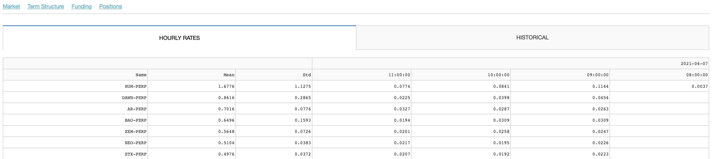

## Delta-One System Documentation

__1. Market Overview__

These are the screens I come to when deciding which spreads to trade. These chart the term structure and list premium on all coins (future-perpetual, spot-perpetual, spot-future) offered on FTX and tries to estimate daily earnings based on the premium that can be collected each day until expiration + funding - 4 * times the fee paid if the position is opened and closed daily.

This net earnings number is just an estimate as the spreads do not always reduce linearly or reduce only for that matter. Moreover, it assumes the positions are closed daily which is not the case. Nonetheless, it does help me understand the cost of holding futures and perpetuals.

__2. Fundings Monitor__

This is where I come to understand the current and past funding rates on the perpetuals for trading perpetual-future spreads. This along with the Term Structure screen helps me compare perpetual funding to future basis in order to decide which pair to trade.

__3. Execution__

I have a basic algo that sends the two legs of the spread order. I specify the pairs, the size, the spread I want to trade. There are a few checks/procedures to avoid the possibility of legging; hitting the book instead of working orders is one of these.

__4. P&L/Risk__

Finally, this is where I check my p&l and risk (it’s all delta one so risk is really just being legged). I store all my filled orders on a database so I can compare my position and balance with what FTX is showing.

At the time of creating this document, there are no active positions. You may compare the top right number on the table (LTD P&L) with the account balance in the screenshot from FTX screen (initial deposit of 100 USD + 37 USD in profit). Ideally I would want this screen to update as soon as possible but my trade feed sends a rest request to FTX every minute to save the trades and then this is built by fetching the trades from the db so there’s about a 90s delay until it updates.

_Notes:_

_Code available upon request._
